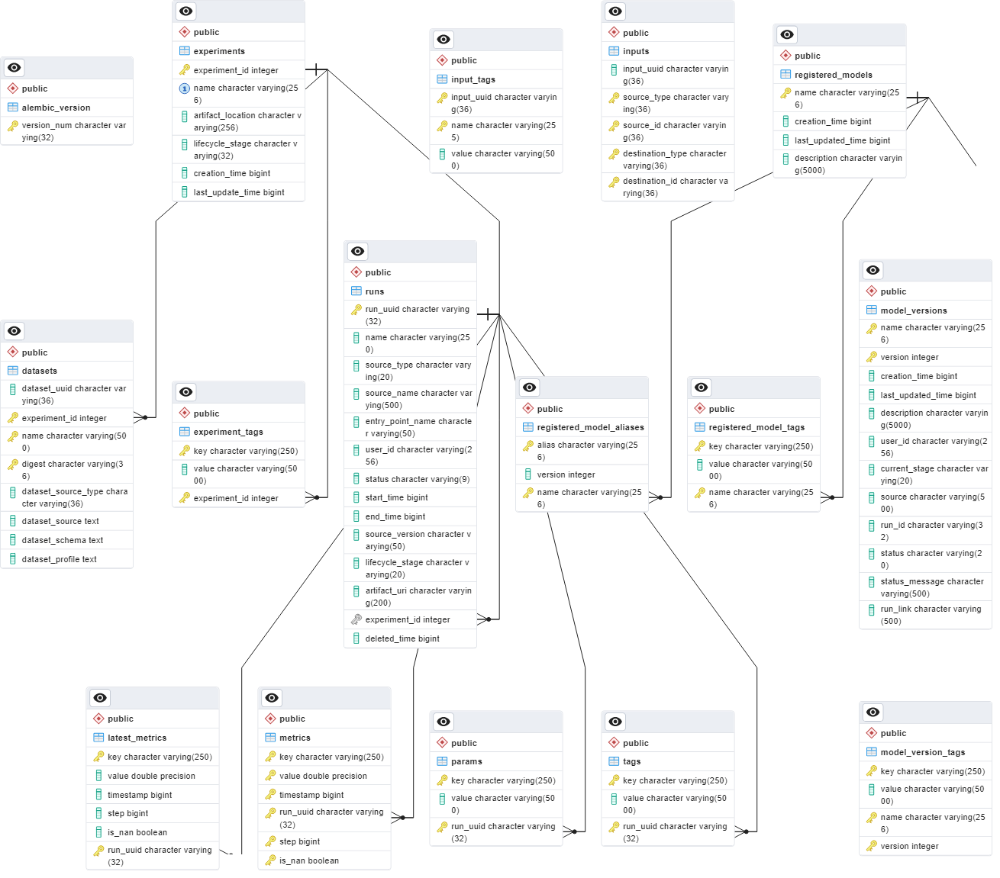

# MLflow Example

This project uses MLflow to track model training experiments and manage artifacts.

We refer to [Scenario 5](https://mlflow.org/docs/latest/tracking.html#scenario-5-mlflow-tracking-server-enabled-with-proxied-artifact-storage-access) to set up a remote MLflow server as proxy server, creating a PostgreSQL database to store model information, and set up MinIO to store model artifacts.

## Components

- MLflow: tracks the experiments and stores the models in the model registry.
- MinIO: A S3-compatible storge that stores the MLflow artifacts.
- PostgreSQL: Stores the MLflow tracking data.

## Prerequsities

- Docker Compose V2
- Python3 (tested with 3.10)
- Available ports:
  - 5001 (for mlflow server)
  - 15432 (for PostgreSQL)
  - 9000, 9001 (for MinIO)

## MLflow Steps

1. genearte a model and wrap it to a wrapped pyfunc.
1. run `mlflow.pyfunc.log_model` to upload the model to artifact storage.
1. run `mlflow.register_model` to register the model in the model registry.
1. run `client.transition_model_version_stage` to transition the model to another stage, such as `Production`.

## Usage

Install Python packages.

```bash
python3 -m pip install pipenv
pipenv install
```

Launch MLflow services.

```bash
docker compose build mlflow
docker compose up -d
```

Run the examples.

```bash
pipenv shell

export MLFLOW_TRACKING_URI="http://127.0.0.1:5001"

python3 train.py
# python3 predict.py
```

### Cleanup

```bash
# close services
docker compose down -v

# delete Python venv
pipenv --rm

```

## Misc

### MLflow ERD


